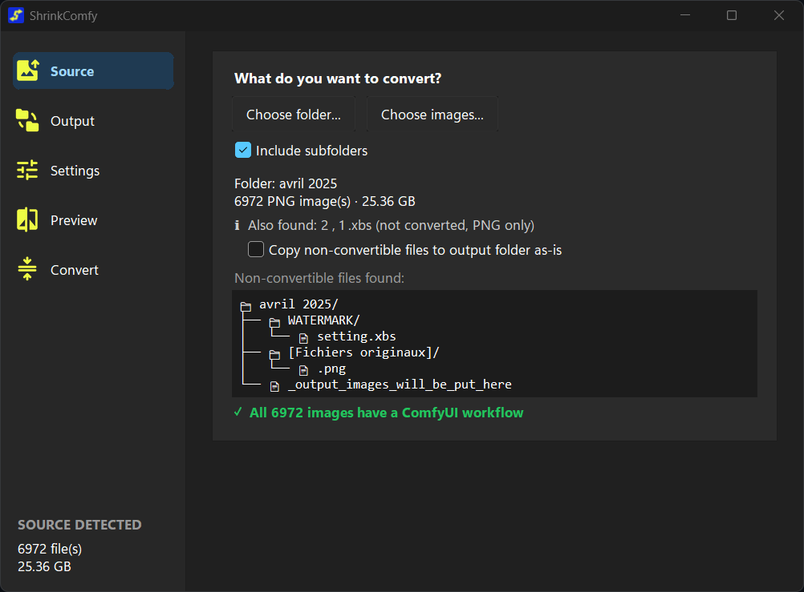
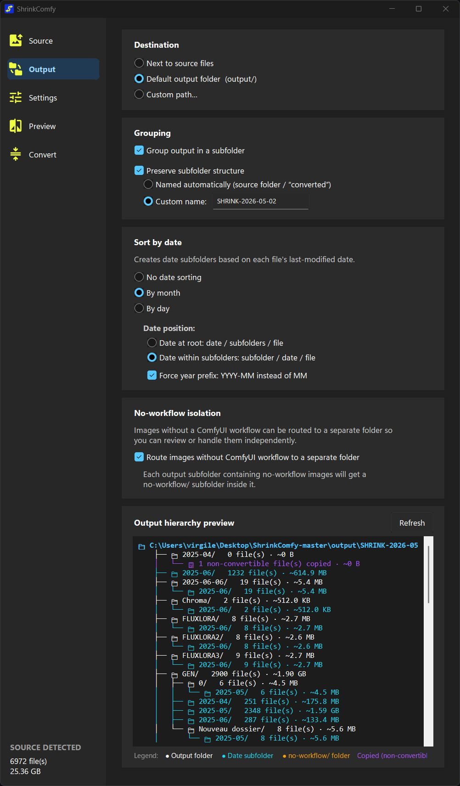
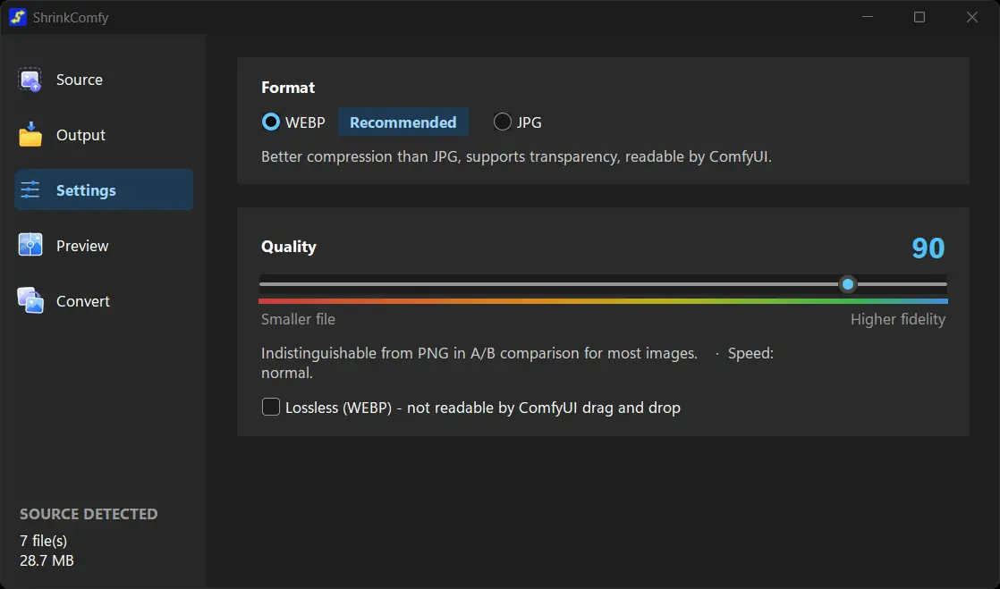
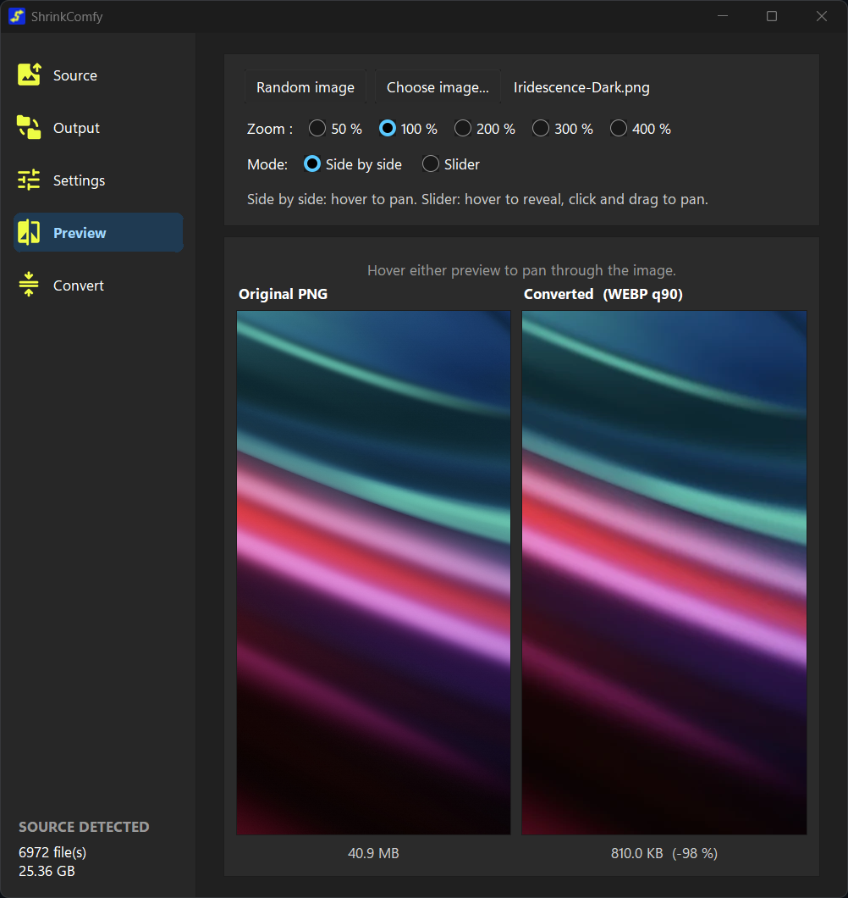
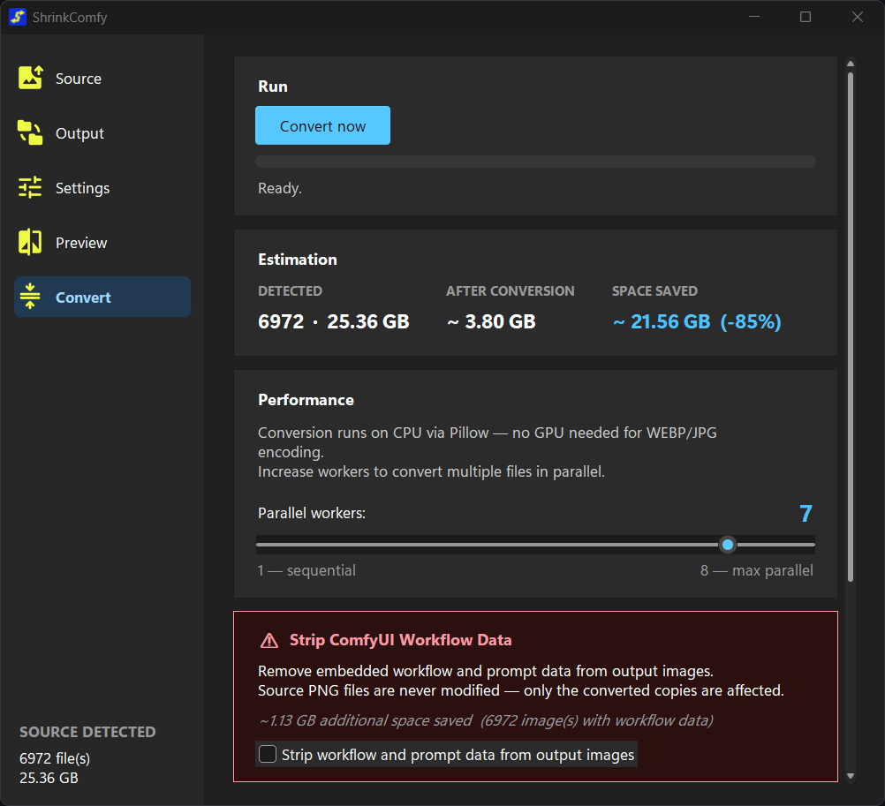

<!-- VISUAL: first visual = app icon. If GitHub does not render .ico nicely, export _app/icons/app.ico to docs/images/app-icon.png and update this src. -->

  

<h1 align="center">ShrinkComfy</h1>

  A small Windows app for shrinking ComfyUI PNGs to WEBP or JPG without killing the drag-and-drop workflow.

ComfyUI PNGs are great because you can drag them back into ComfyUI and recover the workflow. They are also huge.

ShrinkComfy converts those PNGs to much smaller WEBP or JPG files, then puts the ComfyUI `prompt` and `workflow` metadata back into the converted image so drag-and-drop still works.

The original PNG files are not modified.

## Why I Made This

Most converters can make smaller files, but they usually strip the metadata ComfyUI needs. That is fine for normal images, but annoying when the PNG is also your workflow backup.

ShrinkComfy is for the boring but useful case:

- you have a folder full of ComfyUI PNG outputs;
- you want them to take less space;
- you still want to drag the result back into ComfyUI later.

WEBP q90 is the default I would try first. It usually gives a big size drop without obvious quality loss.

## What It Does

ShrinkComfy takes ComfyUI PNG files and converts them to:

- **WEBP**, recommended for smaller files and transparency support;
- **JPG**, useful if you need maximum compatibility.

During conversion it keeps the ComfyUI workflow metadata when possible. If a PNG does not contain ComfyUI metadata, the app tells you instead of pretending everything is fine.

## How The App Works

The app is split into five pages in the left sidebar.

### Source

Pick a folder or a few PNG images. If you pick a folder, you can include subfolders.

ShrinkComfy scans the selection and shows:

- how many PNG files it found;
- the total size;
- whether those PNGs contain ComfyUI workflow data;
- which files do not have workflow metadata;
- which non-PNG files were also found in the folder.

  

### Output

Choose where the converted images should go.

You can save them next to the source files, use the default `output/` folder, or choose a custom folder. For larger folders, the useful options are preserving the source folder structure and sorting converted files by month or day.

There is also a `no-workflow/` routing option for PNGs that do not contain ComfyUI workflow data, which makes them easier to review later.

The output page includes a folder tree preview, so you can check the result before running a big batch.

  

### Settings

Choose the format and quality.

My starting point:

| Goal | Setting |
| --- | --- |
| Good default | WEBP q90 |
| Smaller archive copies | WEBP q80 |
| Compatibility over size | JPG q90 |

Do not use WEBP Lossless if you need drag-and-drop back into ComfyUI. ComfyUI does not read workflows from lossless WEBP files.

  

### Preview

Preview lets you compare the original PNG with the converted result before converting a full folder.

There are two modes:

- side-by-side comparison;
- slider comparison.

You can zoom in and pan around the image, which is useful for checking faces, textures, gradients, and other places where compression artifacts show up first.

  

### Convert

This is where you run the batch.

Before converting, ShrinkComfy estimates:

- detected input size;
- expected output size;
- expected space saved.

During conversion it shows progress and logs each file. You can also choose how many CPU workers to use.

There is a separate danger-zone option to strip workflow and prompt metadata from the converted copies. That is only for cases where you intentionally want clean images without workflow data.

  

## Limitations

- It only converts PNG inputs.
- It is currently a Windows app.
- It needs Python installed on the machine.
- WEBP Lossless is not recommended if you want ComfyUI workflow drag-and-drop.
- Keeping workflow metadata depends on the source PNG actually containing ComfyUI `prompt` or `workflow` data.

## Installation

1. Download or clone this repository.
2. Double-click `ShrinkComfy.bat`.

On first launch, the app creates a local virtual environment in `_app/.venv/` and installs what it needs there. The first launch can take a little longer.

Requirements:

- Windows 10 or 11;
- Python 3.9 or newer;
- Python must be available in `PATH`.

## Uninstall

Delete the ShrinkComfy folder. Everything the app installs is inside the project folder.
